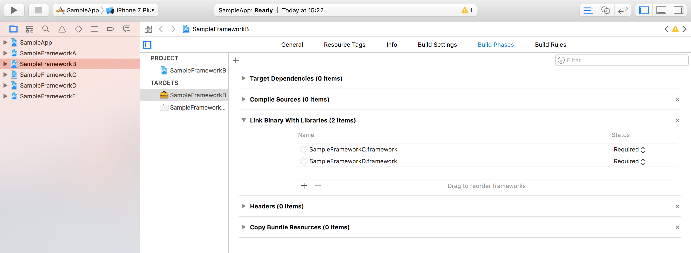
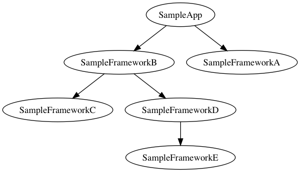

# Pandan

[](https://travis-ci.org/xing/pandan)
[](http://badge.fury.io/rb/pandan)

> Pandanus amaryllifolius is a tropical plant in the Pandanus (screwpine) genus, which is commonly known as pandan leaves, and is used widely in South Asian and Southeast Asian cooking as a flavoring.  
> —[Wikipedia](https://en.wikipedia.org/wiki/Pandanus_amaryllifolius)

`pandan` is a CLI tool that outputs dependency information from a set of Xcode projects with targets that depend on each other, it does it by creating a (reverse) dependency graph using the information in "Link Binary with Libraries" build phase and doing a breadth-first search.

## Installation

`pandan` is distributed as a Ruby gem and can be installed using the following command:

```bash
$ gem install pandan
```

## Motivation

At XING, CocoaPods helped us manage our Objective-C and Swift dependencies for a long time. But as our team grew, it was evident to us that CocoaPods was not the tool we needed anymore. We decided to migrate all our projects to a different setup that uses multiple Xcode projects, targets and xcconfig files under a single workspace. However, we were lacking a tool that would give us dependency information based one the settings already in place in Xcode.

## Usage

Given the following project setup:



where additionally to this, SampleFrameworkD links against SampleFrameworkE:

```bash
$ pandan query SampleFrameworkB # will output:
SampleFrameworkC
SampleFrameworkE
SampleFrameworkD
```

You can generate a complete dependency graph of your workspace that is output as a PNG image. It's a good idea to exclude targets with names ending in "Tests" for a more tidy graph:

```bash
$ pandan dependency-graph --image --filter='^(?!.*Tests$).*$'
```



For a complete and up-to-date usage description, execute:

```bash
$ pandan --help
```
